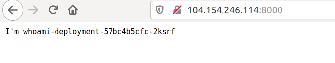
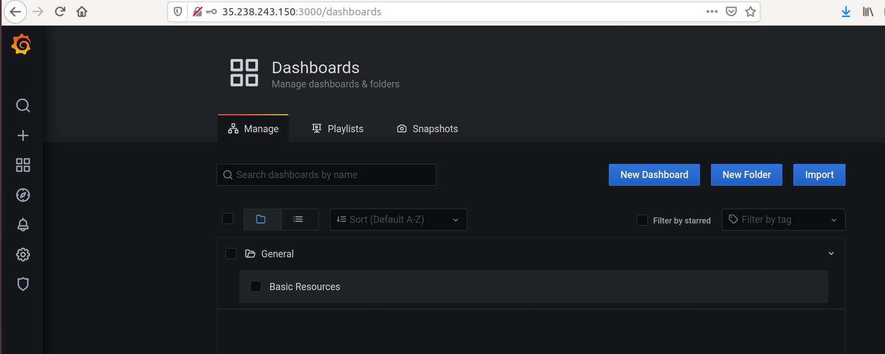
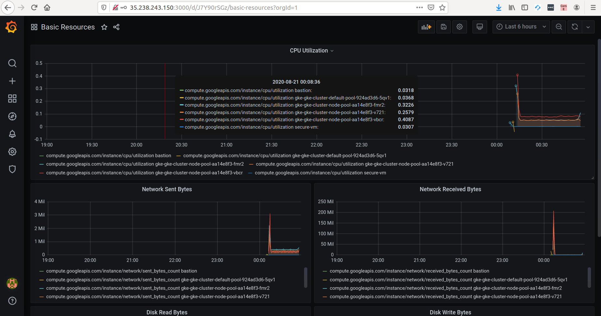

# Platform Operations Challenge

This project builds the proposed infrastructure within GCP. You don't need to create anything in provider console, just follow the steps described in this document.

Thank you for the opportunity to accomplish this challenge, it was a great learning experience!!

## Requirments

To run this tutorial you will need Docker and Terraform.

## Project Setup

Run next command and follow instructions to setup your project. It will configure an environment with gcloud sdk. 

```
make start-project
```

To enable required apis for this project, run (Note: you have to link a billing account to this project): 

```
make enable-apis
```

Create a app engine, to be possible use scheduler service. From [docs](https://cloud.google.com/scheduler/docs/#supported_regions):
```
Cloud Scheduler is currently available in all App Engine supported regions. To use Cloud Scheduler your Cloud project must contain an App Engine app that is located in one of the supported regions. If your project does not have an App Engine app, you must create one.
```

```
make create-app-engine
```


## Terraform Service Account

Set an environment variable containing the path where you wish save your credentials:

```bash
export GOOGLE_APPLICATION_CREDENTIALS=~/.ssh/terraform-gcp-credentials.json
```

Create a service account to terraform, download credentials json file and grant required permissions following:

```
make create-terraform-account
```

## Provisioning

Configure your network on firewall rules in /provisioning/firewall-rules.tf, field "source_ranges".

Init terraform
```
cd provisioning; terraform init
```

You can view terraform plan running:

```bash
terraform plan
```

Provisioning:

```
terraform apply
```

## SSH a internal vm through bastion

Login with gcloud:

```
make login-bastion zone=us-central1-b
```

Create ~/.ssh/config and add the following content:

```
Host *
  IdentityFile ~/.ssh/id_rsa.pub
  User [YOUR USERNAME HERE]

Host bastion
  Hostname [BASTION PUBLIC IP HERE]

Host myvm
  Hostname [INSTANCE PRIVATE IP HERE]
  ProxyCommand ssh bastion -W %h:%p
  LocalForward 8080 127.0.0.1:8080
```

Now you can access directly a secure vm (without public ip): 🚀🚀🚀

```
ssh myvm
```

## Deploy Applications

Configure your kubectl:

```
make configure-kubectl
```

Deploy who-am-i and grafana:

```
make kubectl-apply
```

Check external ips:
```
make kubectl-get-services
```

## WHOAMI APP

<div style="text-align:center"></div>

## MONITORING

Grafana runs on port 3000. Use grafana default admin credentials to login and change your password. You can take a look at the dashboards by accessing the menu panels as illustrated below:



Clicking on `Basic Resources` dashboard you can monitor project infrastructure, collected from gcp stackdriver.

